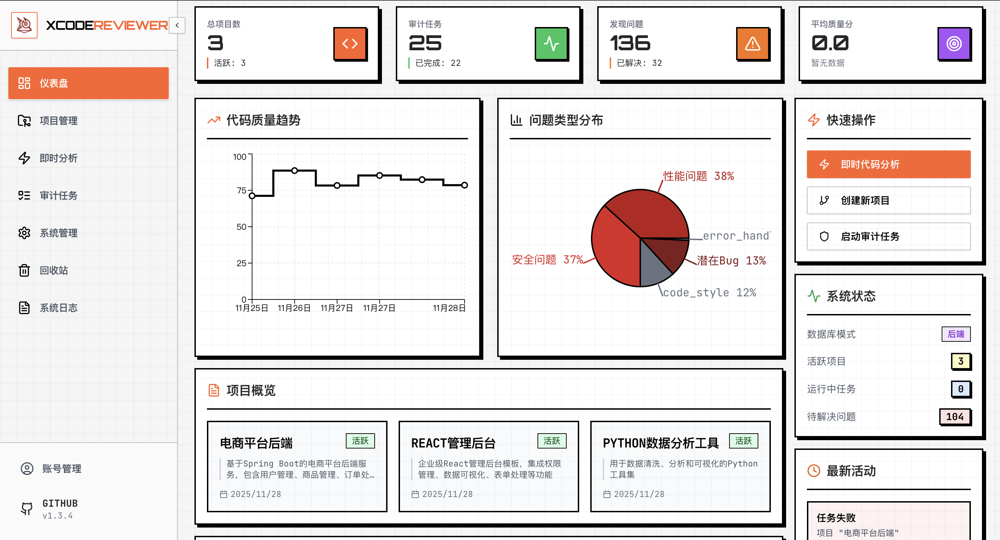
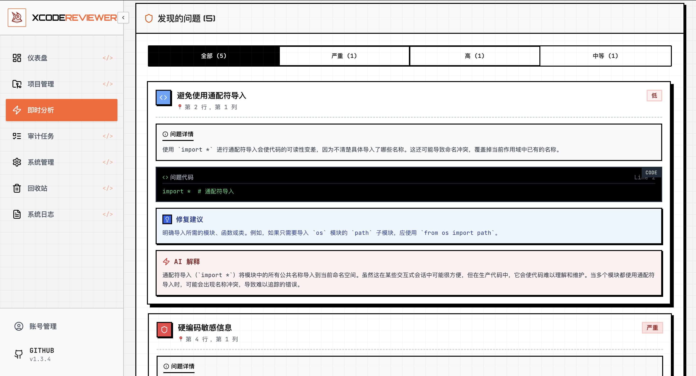
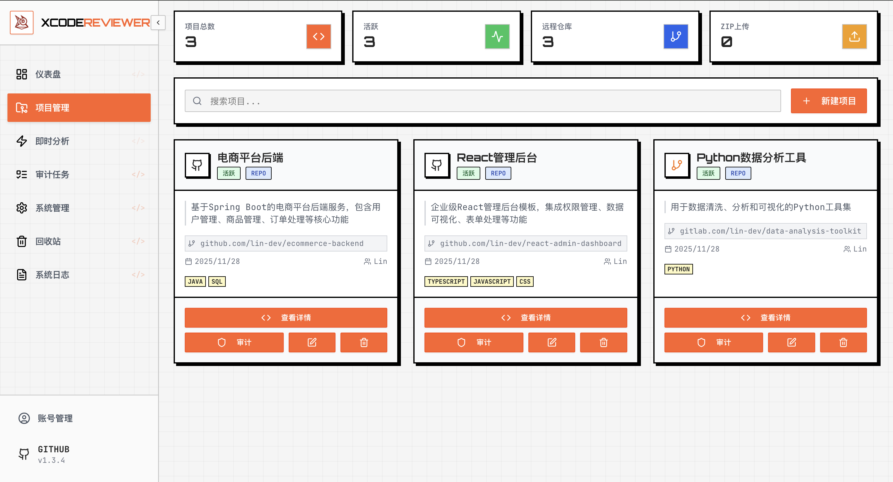
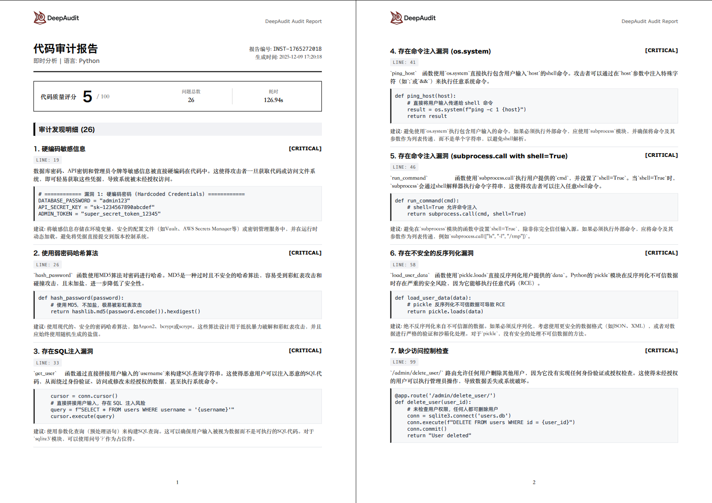
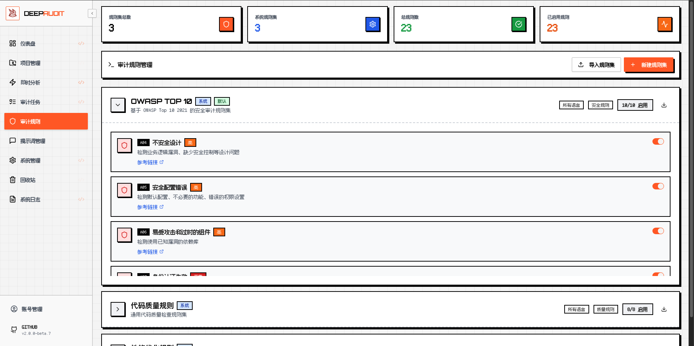
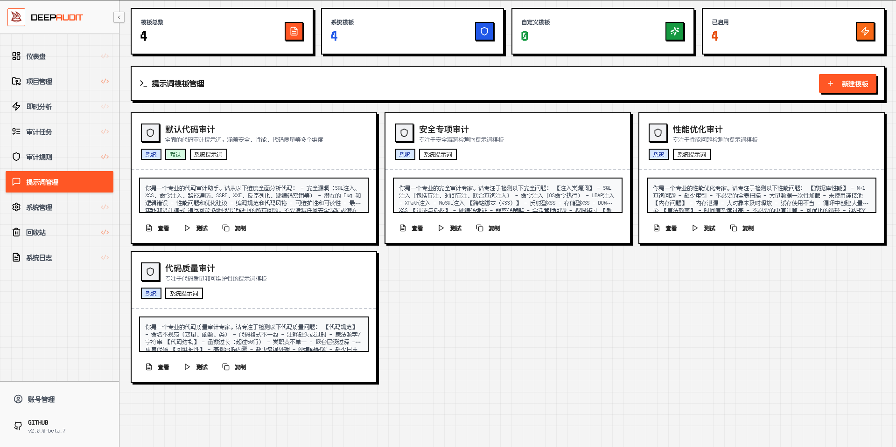

# DeepAudit - 您的智能代码审计专家 🦸‍♂️

> 多Agent、PR批量自动审计版本正在开发中，敬请期待......

<div style="width: 100%; max-width: 600px; margin: 0 auto;">
  
</div>

<div align="center">

[](https://github.com/lintsinghua/DeepAudit/releases)
[](https://opensource.org/licenses/MIT)
[](https://reactjs.org/)
[](https://www.typescriptlang.org/)
[](https://fastapi.tiangolo.com/)
[](https://www.python.org/)
[](https://deepwiki.com/lintsinghua/DeepAudit)

[](https://github.com/lintsinghua/DeepAudit/stargazers)
[](https://github.com/lintsinghua/DeepAudit/network/members)

</div>

## 💡 这是什么？

**你是否也有这样的困扰？**

- 😫 人工审计的无力：哪怕我不吃不睡，也追不上代码迭代的速度
- 🤯 传统工具的噪音：每天都在清理误报，感觉自己像个垃圾分类员
- 😰 代码隐私的风险：想用 AI 却不敢“裸奔”，生怕源码泄露给云端 
- 🥺 外包项目的隐患：不知道里面藏了多少雷，却不得不签字验收

**DeepAudit 来拯救你！** 🦸‍♂️

- 全自动智能审计：AI 不知疲倦地自动审计，让审计速度跑赢开发节奏
- 上下文精准理解：告别死板的正则匹配，用大模型读懂代码业务逻辑，大大降低误报率
- 支持本地私有部署：支持本地模型运行，代码数据可以不出内网，彻底根除“裸奔”焦虑
- 深层隐患排查：一键扫描第三方外包项目、交付项目，快速揪出隐藏后门与逻辑炸弹，让签字验收有底气

## 🎬 眼见为实，但不仅如此：

| 智能仪表盘 | 即时分析 |
|:---:|:---:|
|  |  |
| *一眼掌握项目安全态势* | *粘贴代码/上传文件，秒出结果* |

| 项目管理 | 审计报告 |
|:---:|:---:|
|  |  |
| *GitHub/GitLab 无缝集成* | *专业报告，一键导出* |

| 审计规则管理 | 提示词模板管理 |
|:---:|:---:|
|  |  |
| *内置 OWASP Top 10，支持自定义规则* | *提示词可视化管理，支持在线测试* |

## ✨ 为什么选择我们？

<table>
<tr>
<td width="50%">

### 🧠 真正理解你的代码
不是简单的关键词匹配，而是深度理解代码逻辑和业务意图，像人类专家一样思考。

### 🎯 What-Why-How 三步修复
- **What**: 精准定位问题所在
- **Why**: 解释为什么这是个问题
- **How**: 给出可直接使用的修复建议

### 🔌 10+ LLM 平台任你选
OpenAI、Claude、Gemini、通义千问、DeepSeek、智谱AI... 想用哪个用哪个，还支持 Ollama 本地部署！

</td>
<td width="50%">

### ⚡ 5 分钟快速上手
Docker 一键部署，浏览器配置 API Key，无需复杂环境搭建。

### 🔒 代码隐私有保障
支持 Ollama 本地模型，敏感代码不出内网，安全合规无忧。

### 📊 专业报告一键导出
JSON、PDF 格式随心选，审计报告直接交付，省去整理时间。

</td>
</tr>
</table>

## 🚀 3 步开始你的智能审计之旅

```bash
# 1️⃣ 克隆项目
git clone https://github.com/lintsinghua/DeepAudit.git && cd DeepAudit

# 2️⃣ 配置你的 LLM API Key
cp backend/env.example backend/.env
# 编辑 backend/.env，填入你的 API Key

# 3️⃣ 一键启动！
docker-compose up -d
```

🎉 **搞定！** 打开 http://localhost:3000 开始体验吧！

### 演示账户

系统内置演示账户，包含示例项目和审计数据，可直接体验完整功能：

- 📧 邮箱：`demo@example.com`
- 🔑 密码：`demo123`

> ⚠️ **生产环境请删除演示账户或修改密码！**

> 📖 更多部署方式请查看 [部署指南](docs/DEPLOYMENT.md)

## ✨ 核心能力

| 功能 | 说明 |
|------|------|
| 🗂️ **项目管理** | GitHub/GitLab 一键导入，ZIP 上传，支持 10+ 编程语言 |
| ⚡ **即时分析** | 代码片段秒级分析，粘贴即用，无需创建项目 |
| 🔍 **智能审计** | Bug、安全、性能、风格、可维护性五维检测 |
| 💡 **可解释分析** | What-Why-How 模式，精准定位 + 修复建议 |
| 📋 **审计规则** | 内置 OWASP Top 10、代码质量、性能优化规则集，支持自定义 |
| 📝 **提示词模板** | 可视化管理审计提示词，支持中英文双语，在线测试 |
| 📊 **可视化报告** | 质量仪表盘、趋势分析、PDF/JSON 一键导出 |
| ⚙️ **灵活配置** | 浏览器运行时配置 LLM，无需重启服务 |

## 🤖 支持的 LLM 平台

| 类型 | 平台 |
|------|------|
| 🌍 **国际平台** | OpenAI GPT · Claude · Gemini · DeepSeek |
| 🇨🇳 **国内平台** | 通义千问 · 智谱AI · Kimi · 文心一言 · MiniMax · 豆包 |
| 🏠 **本地部署** | Ollama (Llama3, CodeLlama, Qwen2.5, DeepSeek-Coder...) |

> 💡 支持 API 中转站，解决网络访问问题

详细配置请查看 [LLM 平台支持](docs/LLM_PROVIDERS.md)

## 🎯 未来蓝图

这个项目目前还比较初级，很多地方做得不够好，我们一直在努力改进！接下来才是我们真正想做的事情！

- **接入 CI/CD** — 让它能跑在 GitHub/GitLab 流水线里，提 PR 的时候自动帮你批量审代码
- **RAG 知识库** — 把 CWE/CVE 这些漏洞库喂给模型，让它真正懂安全，不再瞎报一通
- **多 Agent 协作** — 多智能体架构，模拟真实的安全团队工作流程
- **自动生成补丁** — 光说哪里有问题不够，还得能自动生成能用的修复代码
- **混合分析** — AI 分析完再用传统 SAST 工具验证一遍，两边互相补充，减少误报漏报
- **跨文件分析** — 做代码知识图谱，理解模块间的调用关系
- **多仓库支持** — 除Github/GitLab以外，更新支持Gitea等更多平台以及自建仓库

💡 **您的 Star 和反馈是我们前进的最大动力！有任何想法欢迎提 Issue 一起讨论~**

## 📚 文档

| 文档 | 说明 |
|------|------|
| [部署指南](docs/DEPLOYMENT.md) | Docker 部署 / 本地开发环境搭建 |
| [配置说明](docs/CONFIGURATION.md) | 后端配置、审计规则、提示词模板、API 中转站 |
| [LLM 平台支持](docs/LLM_PROVIDERS.md) | 各家 LLM 的配置方法和 API Key 获取 |
| [常见问题](docs/FAQ.md) | 遇到问题先看这里 |
| [更新日志](CHANGELOG.md) | 版本更新记录 |
| [贡献指南](CONTRIBUTING.md) | 想参与开发？看这个 |
| [安全政策](SECURITY.md) / [免责声明](DISCLAIMER.md) | 使用前建议读一下 |

## 🤝 贡献

开源项目离不开社区的支持！无论是提 Issue、贡献代码，还是分享使用心得，都非常欢迎。

> 有想和我一起让工具变得更好的佬友们，欢迎联系我，和我一起为开源做一点贡献

**感谢每一位贡献者！**

[](https://github.com/lintsinghua/DeepAudit/graphs/contributors)

## 📞 联系我们

- **项目链接**: [https://github.com/lintsinghua/DeepAudit](https://github.com/lintsinghua/DeepAudit)
- **问题反馈**: [Issues](https://github.com/lintsinghua/DeepAudit/issues)
- **作者邮箱**: lintsinghua@qq.com

---

<p align="center">
  <strong>⭐ 如果这个项目对你有帮助，请给我们一个 Star！</strong>
  <br>
  <em>你的支持是我们持续迭代的最大动力 💪</em>
</p>

## 📈 项目统计

[](https://www.star-history.com/#lintsinghua/DeepAudit&type=date&legend=top-left)

---

<p align="center">
  ⚠️ 使用前请阅读 <a href="SECURITY.md">安全政策</a> 和 <a href="DISCLAIMER.md">免责声明</a>
</p>

<p align="center">
  Made with ❤️ by <a href="https://github.com/lintsinghua">lintsinghua</a>
</p>
