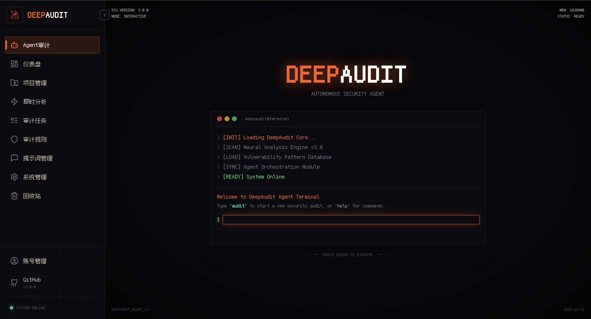
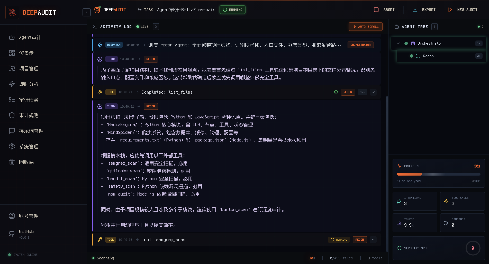
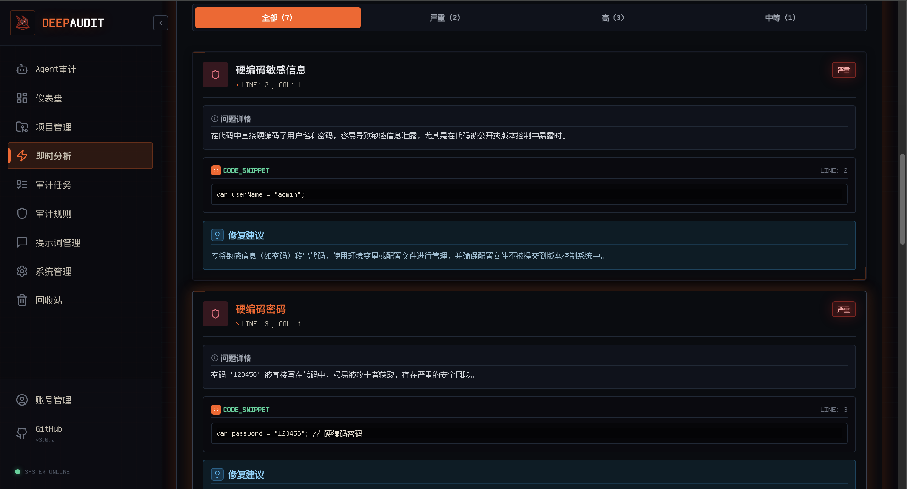
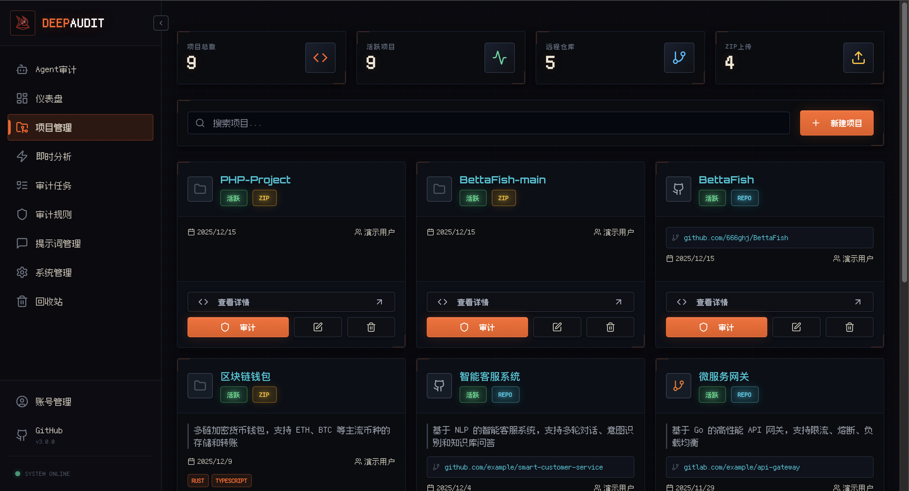
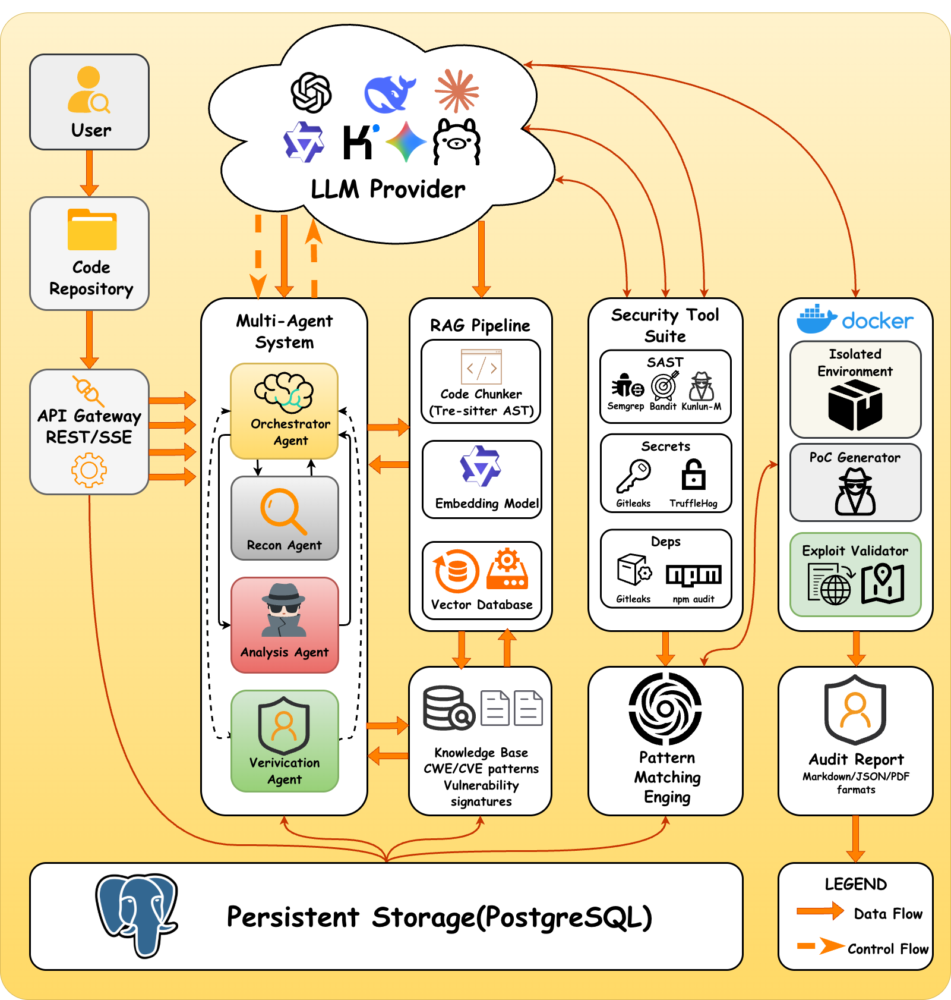
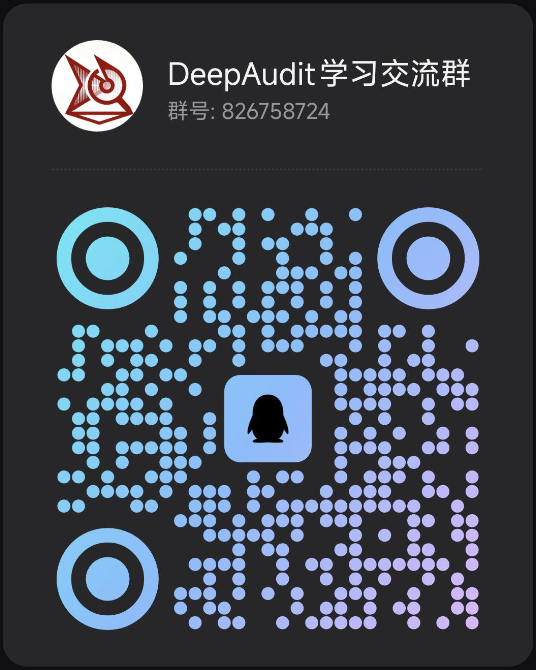

# DeepAudit - Your AI Security Audit Team, Making Vulnerability Discovery Accessible

<p align="center">
  <a href="README.md">简体中文</a> | <strong>English</strong>
</p>

<div style="width: 100%; max-width: 600px; margin: 0 auto;">
  
</div>

<div align="center">

[](https://github.com/lintsinghua/DeepAudit/releases)
[](https://www.gnu.org/licenses/agpl-3.0)
[](https://reactjs.org/)
[](https://www.typescriptlang.org/)
[](https://fastapi.tiangolo.com/)
[](https://www.python.org/)
[](https://deepwiki.com/lintsinghua/DeepAudit)

[](https://github.com/lintsinghua/DeepAudit/stargazers)
[](https://github.com/lintsinghua/DeepAudit/network/members)

<a href="https://trendshift.io/repositories/15634" target="_blank"></a>


</div>

<div align="center">
  
</div>

---


## Screenshots

<div align="center">

### Agent Audit Entry



*Quick access to Multi-Agent deep audit from homepage*

</div>

<table>
<tr>
<td width="50%" align="center">
<strong>Audit Flow Logs</strong><br/><br/>
<br/>
<em>Real-time view of Agent thinking and execution process</em>
</td>
<td width="50%" align="center">
<strong>Smart Dashboard</strong><br/><br/>
<br/>
<em>Grasp project security posture at a glance</em>
</td>
</tr>
<tr>
<td width="50%" align="center">
<strong>Instant Analysis</strong><br/><br/>
<br/>
<em>Paste code / upload files, get results in seconds</em>
</td>
<td width="50%" align="center">
<strong>Project Management</strong><br/><br/>
<br/>
<em>GitHub/GitLab import, multi-project collaboration</em>
</td>
</tr>
</table>

<div align="center">

### Professional Reports


*One-click export to PDF / Markdown / JSON* (Quick mode shown, not Agent mode report)

[View Full Agent Audit Report Example](https://lintsinghua.github.io/)

</div>

---

## Overview

**DeepAudit** is a next-generation code security audit platform based on **Multi-Agent collaborative architecture**. It's not just a static scanning tool, but simulates the thinking patterns of security experts through autonomous collaboration of multiple agents (**Orchestrator**, **Recon**, **Analysis**, **Verification**), achieving deep code understanding, vulnerability discovery, and **automated sandbox PoC verification**.

We are committed to solving three major pain points of traditional SAST tools:
- **High false positive rate** — Lack of semantic understanding, massive false positives consume manpower
- **Business logic blind spots** — Cannot understand cross-file calls and complex logic
- **Lack of verification methods** — Don't know if vulnerabilities are actually exploitable

Users only need to import a project, and DeepAudit automatically starts working: identify tech stack → analyze potential risks → generate scripts → sandbox verification → generate report, ultimately outputting a professional audit report.

> **Core Philosophy**: Let AI attack like a hacker, defend like an expert.

## Why Choose DeepAudit?

<div align="center">

| Traditional Audit Pain Points | DeepAudit Solutions |
| :--- | :--- |
| **Low manual audit efficiency**<br>Can't keep up with CI/CD iteration speed, slowing release process | **Multi-Agent Autonomous Audit**<br>AI automatically orchestrates audit strategies, 24/7 automated execution |
| **Too many false positives**<br>Lack of semantic understanding, spending lots of time cleaning noise daily | **RAG Knowledge Enhancement**<br>Combining code semantics with context, significantly reducing false positives |
| **Data privacy concerns**<br>Worried about core source code leaking to cloud AI, can't meet compliance requirements | **Ollama Local Deployment Support**<br>Data stays on-premises, supports Llama3/DeepSeek and other local models |
| **Can't confirm authenticity**<br>Outsourced projects have many vulnerabilities, don't know which are truly exploitable | **Sandbox PoC Verification**<br>Automatically generate and execute attack scripts, confirm real vulnerability impact |

</div>

---

## System Architecture

### Architecture Diagram

DeepAudit adopts microservices architecture, driven by the Multi-Agent engine at its core.

<div align="center">

</div>

### Audit Workflow

| Step | Phase | Responsible Agent | Main Actions |
|:---:|:---:|:---:|:---|
| 1 | **Strategy Planning** | **Orchestrator** | Receive audit task, analyze project type, formulate audit plan, dispatch tasks to sub-agents |
| 2 | **Information Gathering** | **Recon Agent** | Scan project structure, identify frameworks/libraries/APIs, extract attack surface (Entry Points) |
| 3 | **Vulnerability Discovery** | **Analysis Agent** | Combine RAG knowledge base with AST analysis, deep code review, discover potential vulnerabilities |
| 4 | **PoC Verification** | **Verification Agent** | **(Critical)** Write PoC scripts, execute in Docker sandbox. Self-correct and retry if failed |
| 5 | **Report Generation** | **Orchestrator** | Aggregate all findings, filter out verified false positives, generate final report |

### Project Structure

```text
DeepAudit/
├── backend/                        # Python FastAPI Backend
│   ├── app/
│   │   ├── agents/                 # Multi-Agent Core Logic
│   │   │   ├── orchestrator.py     # Commander: Task Orchestration
│   │   │   ├── recon.py            # Scout: Asset Identification
│   │   │   ├── analysis.py         # Analyst: Vulnerability Discovery
│   │   │   └── verification.py     # Verifier: Sandbox PoC
│   │   ├── core/                   # Core Config & Sandbox Interface
│   │   ├── models/                 # Database Models
│   │   └── services/               # RAG, LLM Service Wrappers
│   └── tests/                      # Unit Tests
├── frontend/                       # React + TypeScript Frontend
│   ├── src/
│   │   ├── components/             # UI Component Library
│   │   ├── pages/                  # Page Routes
│   │   └── stores/                 # Zustand State Management
├── docker/                         # Docker Deployment Config
│   ├── sandbox/                    # Security Sandbox Image Build
│   └── postgres/                   # Database Initialization
└── docs/                           # Detailed Documentation
```

---

## Quick Start

### Option 1: One-Line Deployment (Recommended)

Using pre-built Docker images, no need to clone code, start with one command:

```bash
curl -fsSL https://raw.githubusercontent.com/lintsinghua/DeepAudit/v3.0.0/docker-compose.prod.yml | docker compose -f - up -d
```

> **Success!** Visit http://localhost:3000 to start exploring.

---

### Option 2: Clone and Deploy

Suitable for users who need custom configuration or secondary development:

```bash
# 1. Clone project
git clone https://github.com/lintsinghua/DeepAudit.git && cd DeepAudit

# 2. Configure environment variables
cp backend/env.example backend/.env
# Edit backend/.env and fill in your LLM API Key

# 3. One-click start
docker compose up -d
```

> First startup will automatically build the sandbox image, which may take a few minutes.

---

## Development Guide

For developers doing secondary development and debugging.

### Requirements
- Python 3.11+
- Node.js 20+
- PostgreSQL 15+
- Docker (for sandbox)

### 1. Backend Setup

```bash
cd backend
# Use uv for environment management (recommended)
uv sync
source .venv/bin/activate

# Start API service
uvicorn app.main:app --reload
```

### 2. Frontend Setup

```bash
cd frontend
pnpm install
pnpm dev
```

### 3. Sandbox Environment

Development mode requires pulling the sandbox image locally:

```bash
docker pull ghcr.io/lintsinghua/deepaudit-sandbox:latest
```

---

## Multi-Agent Intelligent Audit

### Supported Vulnerability Types

<table>
<tr>
<td>

| Vulnerability Type | Description |
|---------|------|
| `sql_injection` | SQL Injection |
| `xss` | Cross-Site Scripting |
| `command_injection` | Command Injection |
| `path_traversal` | Path Traversal |
| `ssrf` | Server-Side Request Forgery |
| `xxe` | XML External Entity Injection |

</td>
<td>

| Vulnerability Type | Description |
|---------|------|
| `insecure_deserialization` | Insecure Deserialization |
| `hardcoded_secret` | Hardcoded Secrets |
| `weak_crypto` | Weak Cryptography |
| `authentication_bypass` | Authentication Bypass |
| `authorization_bypass` | Authorization Bypass |
| `idor` | Insecure Direct Object Reference |

</td>
</tr>
</table>

> For detailed documentation, see **[Agent Audit Guide](docs/AGENT_AUDIT.md)**

---

## Supported LLM Platforms

<table>
<tr>
<td align="center" width="33%">
<h3>International Platforms</h3>
<p>
OpenAI GPT-4o / GPT-4<br/>
Claude 3.5 Sonnet / Opus<br/>
Google Gemini Pro<br/>
DeepSeek V3
</p>
</td>
<td align="center" width="33%">
<h3>Chinese Platforms</h3>
<p>
Qwen (Tongyi Qianwen)<br/>
Zhipu GLM-4<br/>
Moonshot Kimi<br/>
Wenxin · MiniMax · Doubao
</p>
</td>
<td align="center" width="33%">
<h3>Local Deployment</h3>
<p>
<strong>Ollama</strong><br/>
Llama3 · Qwen2.5 · CodeLlama<br/>
DeepSeek-Coder · Codestral<br/>
<em>Code stays on-premises</em>
</p>
</td>
</tr>
</table>

> Supports API proxies to solve network access issues | Detailed configuration → [LLM Platform Support](docs/LLM_PROVIDERS.md)

---

## Feature Matrix

| Feature | Description | Mode |
|------|------|------|
| **Agent Deep Audit** | Multi-Agent collaboration, autonomous audit strategy orchestration | Agent |
| **RAG Knowledge Enhancement** | Code semantic understanding, CWE/CVE knowledge base retrieval | Agent |
| **Sandbox PoC Verification** | Docker isolated execution, verify vulnerability validity | Agent |
| **Project Management** | GitHub/GitLab import, ZIP upload, 10+ language support | General |
| **Instant Analysis** | Code snippet analysis in seconds, paste and use | General |
| **Five-Dimensional Detection** | Bug · Security · Performance · Style · Maintainability | General |
| **What-Why-How** | Precise location + cause explanation + fix suggestions | General |
| **Audit Rules** | Built-in OWASP Top 10, supports custom rule sets | General |
| **Prompt Templates** | Visual management, bilingual support | General |
| **Report Export** | One-click export to PDF / Markdown / JSON | General |
| **Runtime Configuration** | Configure LLM in browser, no service restart needed | General |

## Roadmap

We are continuously evolving, with more language support and stronger Agent capabilities coming.

- [x] Basic static analysis, Semgrep integration
- [x] RAG knowledge base introduction, Docker security sandbox support
- [x] **Multi-Agent Collaborative Architecture** (Current)
- [ ] Support for more realistic simulated service environments for more authentic vulnerability verification
- [ ] Optimize sandbox from function_call to stable MCP service
- [ ] **Auto-Fix**: Agent directly submits PRs to fix vulnerabilities
- [ ] **Incremental PR Audit**: Continuously track PR changes, intelligently analyze vulnerabilities, integrate with CI/CD
- [ ] **Optimized RAG**: Support custom knowledge bases

---

## Contributing & Community

### Contributing Guide
We warmly welcome your contributions! Whether it's submitting Issues, PRs, or improving documentation.
Please check [CONTRIBUTING.md](./CONTRIBUTING.md) for details.

### Contact

<div align="center">

**Feel free to reach out for technical discussions, feature suggestions, or collaboration opportunities!**

| Contact | |
|:---:|:---:|
| **Email** | **lintsinghua@qq.com** |
| **GitHub** | [@lintsinghua](https://github.com/lintsinghua) |

### 💬 Community Group

**Welcome to join our QQ group for discussion, sharing, learning, and chatting~**



</div>

## License

This project is open-sourced under the [AGPL-3.0 License](LICENSE).

## Star History

<a href="https://star-history.com/#lintsinghua/DeepAudit&Date">
 <picture>
   <source media="(prefers-color-scheme: dark)" srcset="https://api.star-history.com/svg?repos=lintsinghua/DeepAudit&type=Date&theme=dark" />
   <source media="(prefers-color-scheme: light)" srcset="https://api.star-history.com/svg?repos=lintsinghua/DeepAudit&type=Date" />
   
 </picture>
</a>

---

<div align="center">
  <strong>Made with ❤️ by <a href="https://github.com/lintsinghua">lintsinghua</a></strong>
</div>

---

## Acknowledgements

Thanks to the following open-source projects for their support:

[FastAPI](https://fastapi.tiangolo.com/) · [LangChain](https://langchain.com/) · [LangGraph](https://langchain-ai.github.io/langgraph/) · [ChromaDB](https://www.trychroma.com/) · [LiteLLM](https://litellm.ai/) · [Tree-sitter](https://tree-sitter.github.io/) · [Kunlun-M](https://github.com/LoRexxar/Kunlun-M) · [Strix](https://github.com/usestrix/strix) · [React](https://react.dev/) · [Vite](https://vitejs.dev/) · [Radix UI](https://www.radix-ui.com/) · [TailwindCSS](https://tailwindcss.com/) · [shadcn/ui](https://ui.shadcn.com/)

---

## Important Security Notice

### Legal Compliance Statement
1. **Any unauthorized vulnerability testing, penetration testing, or security assessment is prohibited**
2. This project is only for cybersecurity academic research, teaching, and learning purposes
3. It is strictly prohibited to use this project for any illegal purposes or unauthorized security testing

### Vulnerability Reporting Responsibility
1. When discovering any security vulnerabilities, please report them through legitimate channels promptly
2. It is strictly prohibited to use discovered vulnerabilities for illegal activities
3. Comply with national cybersecurity laws and regulations, maintain cyberspace security

### Usage Restrictions
- Only for educational and research purposes in authorized environments
- Prohibited for security testing on unauthorized systems
- Users are fully responsible for their own actions

### Disclaimer
The author is not responsible for any direct or indirect losses caused by the use of this project. Users bear full legal responsibility for their own actions.

---

## Detailed Security Policy

For detailed information about installation policy, disclaimer, code privacy, API usage security, and vulnerability reporting, please refer to [DISCLAIMER.md](DISCLAIMER.md) and [SECURITY.md](SECURITY.md) files.

### Quick Reference
- **Code Privacy Warning**: Your code will be sent to the selected LLM provider's servers
- **Sensitive Code Handling**: Use local models for sensitive code
- **Compliance Requirements**: Comply with data protection and privacy laws
- **Vulnerability Reporting**: Report security issues through legitimate channels
