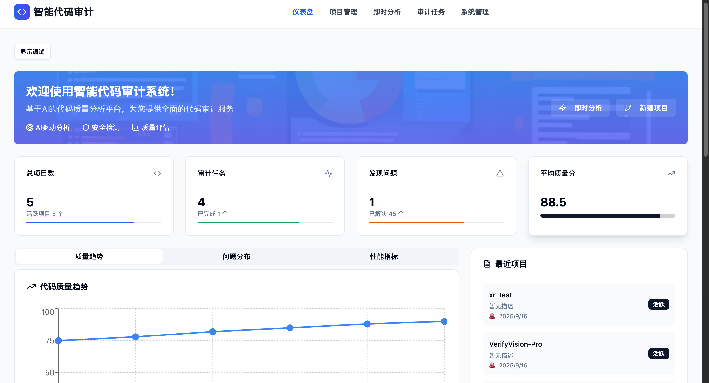
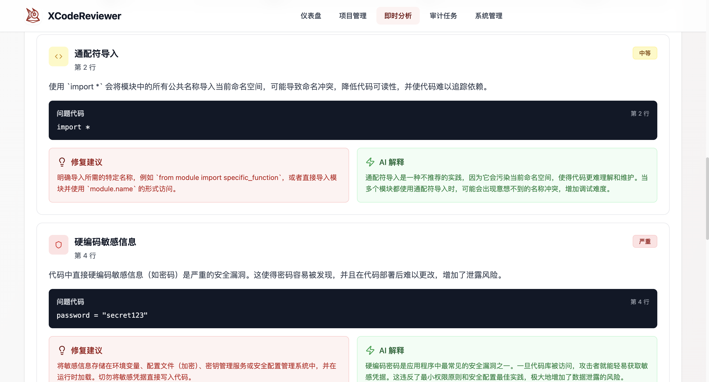
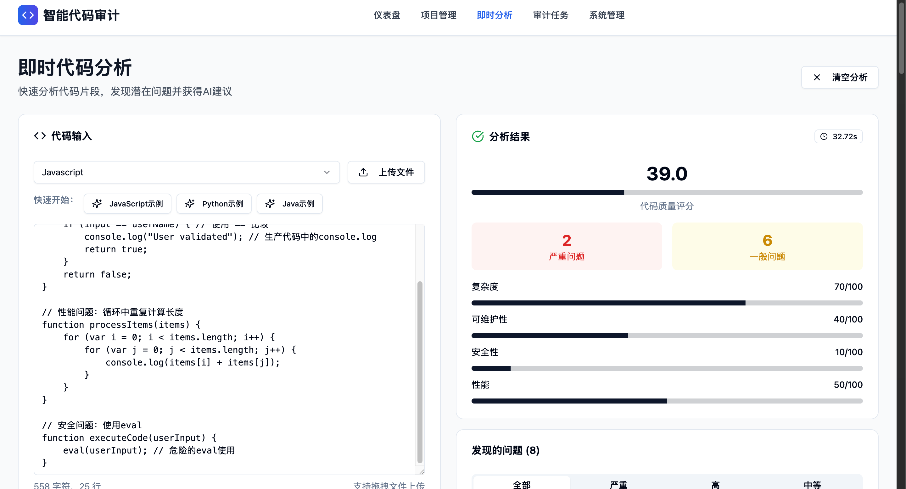
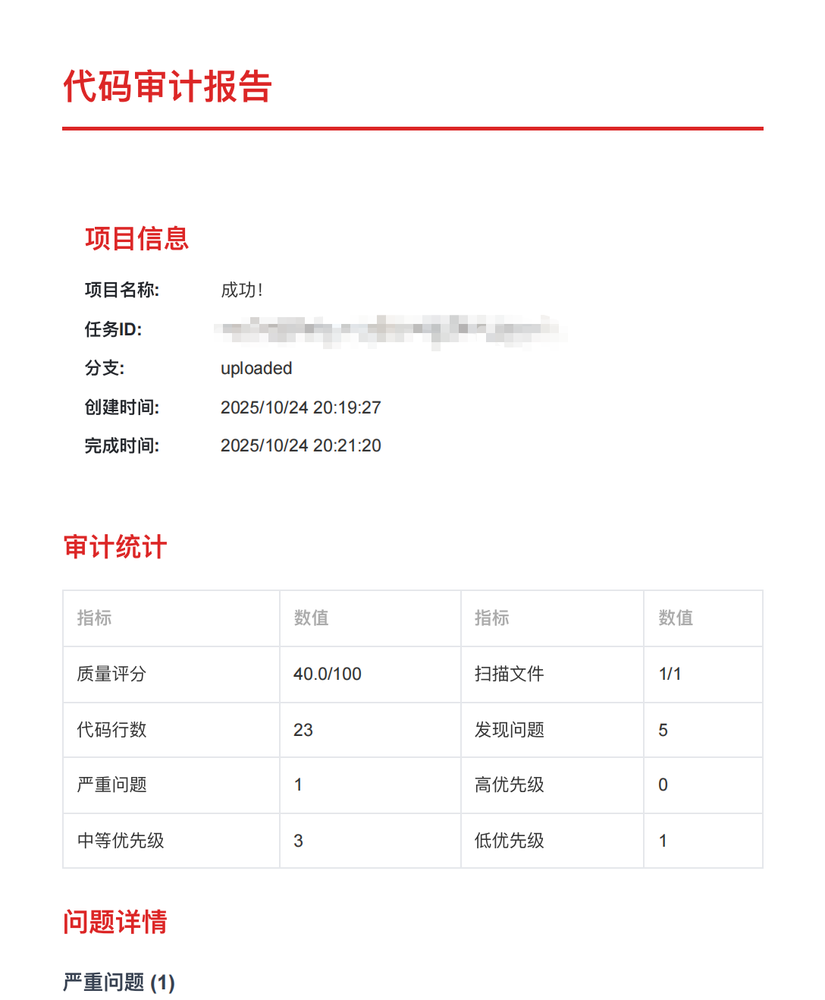

# XCodeReviewer - Your Intelligent Code Audit Partner 🚀

<div style="width: 100%; max-width: 600px; margin: 0 auto;">
  
</div>

<div align="center">
  <p>
    <a href="README.md">中文</a> •
    <a href="README_EN.md">English</a>
  </p>
</div>

<div align="center">

[](https://github.com/lintsinghua/XCodeReviewer/releases)
[](https://opensource.org/licenses/MIT)
[](https://reactjs.org/)
[](https://www.typescriptlang.org/)
[](https://vitejs.dev/)

[](https://github.com/lintsinghua/XCodeReviewer/stargazers)
[](https://github.com/lintsinghua/XCodeReviewer/network/members)

[](https://github.com/lintsinghua/lintsinghua.github.io/issues/1)

</div>

<div style="width: 100%; max-width: 600px; margin: 0 auto;">
  <a href="https://github.com/lintsinghua/XCodeReviewer">
    
  </a>
</div>

**XCodeReviewer** is a modern code audit platform powered by Large Language Models (LLM), designed to provide developers with intelligent, comprehensive, and in-depth code quality analysis and review services.

## 🌟 Why Choose XCodeReviewer?

In the fast-paced world of software development, ensuring code quality is crucial. Traditional code audit tools are rigid and inefficient, while manual audits are time-consuming and labor-intensive. XCodeReviewer leverages the powerful capabilities of LLM to revolutionize the way code reviews are conducted:


<div div align="center">
  <em>
    System Architecture Diagram of XCodeReviewer
  </em>
</div>

---

- **🤖 AI-Driven Deep Analysis**: Beyond traditional static analysis, understands code intent and discovers deep logical issues.
- **🎯 Multi-dimensional, Comprehensive Assessment**: From **security**, **performance**, **maintainability** to **code style**, providing 360-degree quality evaluation.
- **💡 Clear, Actionable Fix Suggestions**: Innovative **What-Why-How** approach that not only tells you "what" the problem is, but also explains "why" and provides "how to fix" with specific code examples.
- **✅ Multi-Platform LLM/Local Model Support**: Implemented API calling functionality for 10+ mainstream platforms (Gemini, OpenAI, Claude, Qwen, DeepSeek, Zhipu AI, Kimi, ERNIE, MiniMax, Doubao, Ollama Local Models), with support for free configuration and switching
- **⚙️ Visual Runtime Configuration**: Configure all LLM parameters and API Keys directly in the browser without rebuilding images. Supports API relay services, with configurations saved locally in the browser for security and convenience.
- **✨ Modern, Beautiful User Interface**: Built with React + TypeScript, providing a smooth and intuitive user experience.

## 🎬 Project Demo

### Main Feature Interfaces

#### 📊 Intelligent Dashboard

*Real-time display of project statistics, quality trends, and system performance, providing comprehensive code audit overview*

#### ⚡ Instant Analysis

*Support for quick code snippet analysis with detailed What-Why-How explanations and fix suggestions*

#### 🚀 Project Management

*Integrated GitHub/GitLab repositories, supporting multi-language project audits and batch code analysis*

#### 📄 Audit Report Export

*Support exporting professional audit reports in JSON and PDF formats, including complete issue details and fix suggestions*

## 🚀 Quick Start

### 🐳 Docker Deployment (Recommended)

#### Method 1: Use Published Image (Easiest) ⭐

Directly use the latest published Docker image, supports x86, ARM64 (Mac M-series), and ARMv7 architectures:

```bash
# 1. Pull the latest image
docker pull ghcr.io/lintsinghua/xcodereviewer:latest

# 2. Run container
docker run -d \
  -p 8888:80 \
  --name xcodereviewer \
  --restart unless-stopped \
  ghcr.io/lintsinghua/xcodereviewer:latest

# 3. Access the application
# Open http://localhost:8888 in your browser
```

**Use specific version**:
```bash
# Pull specific version (e.g., v1.1.0)
docker pull ghcr.io/lintsinghua/xcodereviewer:v1.1.0

# Run
docker run -d -p 8888:80 --name xcodereviewer ghcr.io/lintsinghua/xcodereviewer:v1.1.0
```

#### Method 2: Local Build (Optional)

If you need custom build:

```bash
# 1. Clone the project
git clone https://github.com/lintsinghua/XCodeReviewer.git
cd XCodeReviewer

# 2. Build and start with Docker Compose
docker-compose up -d

# 3. Access the application
# Open http://localhost:8888 in your browser
```

**✨ Runtime Configuration (Recommended)**

After Docker deployment, you can configure all settings directly in the browser without rebuilding the image:

1. Visit `http://localhost:8888/admin` (System Management page)
2. Configure LLM API Keys and other parameters in the "System Configuration" tab
3. Click save and refresh the page to use

> 📖 **For detailed configuration instructions, see**: [System Configuration Guide](#system-configuration-first-time-setup)

### 💻 Local Development Deployment

Suitable for development or custom modifications.

#### Requirements
- Node.js 18+
- pnpm 8+ (recommended) or npm/yarn

#### Quick Setup

```bash
# 1. Clone the project
git clone https://github.com/lintsinghua/XCodeReviewer.git
cd XCodeReviewer

# 2. Install dependencies
pnpm install  # or npm install / yarn install

# 3. Configure environment variables
cp .env.example .env
# Edit .env file, configure required parameters (see configuration guide below)

# 4. Start development server
pnpm dev

# 5. Access the application
# Open http://localhost:5173 in your browser
```

#### Core Configuration

Edit `.env` file and configure the following required parameters:

```env
# ========== Required Configuration ==========
# LLM Provider (gemini|openai|claude|qwen|deepseek|zhipu|moonshot|baidu|minimax|doubao|ollama)
VITE_LLM_PROVIDER=gemini
# Corresponding API Key
VITE_LLM_API_KEY=your_api_key_here

# ========== Database Configuration (Choose One) ==========
# Option 1: Local Database (Recommended, ready to use)
VITE_USE_LOCAL_DB=true

# Option 2: Supabase Cloud Database (Multi-device sync)
# VITE_SUPABASE_URL=https://your-project.supabase.co
# VITE_SUPABASE_ANON_KEY=your_anon_key

# Option 3: Demo Mode (No database, data not persistent)

# ========== Optional Configuration ==========
# GitHub Integration (for repository analysis)
# VITE_GITHUB_TOKEN=your_github_token

# Output Language (zh-CN: Chinese | en-US: English)
VITE_OUTPUT_LANGUAGE=en-US

# Analysis Parameters
VITE_MAX_ANALYZE_FILES=40    # Max files per analysis
VITE_LLM_CONCURRENCY=2       # Concurrent requests
VITE_LLM_GAP_MS=500          # Request interval (ms)
```

#### Advanced Configuration

For timeout or connection issues, adjust these parameters:

```env
VITE_LLM_TIMEOUT=300000                      # Increase timeout
VITE_LLM_BASE_URL=https://your-proxy.com/v1 # Use proxy or relay service
VITE_LLM_CONCURRENCY=1                       # Reduce concurrency
VITE_LLM_GAP_MS=1000                         # Increase request interval
```

**Custom Headers Example** (for special relay services):

```env
# JSON format string
VITE_LLM_CUSTOM_HEADERS='{"X-API-Version":"v1","X-Custom-Auth":"token123"}'
```

### FAQ

<details>
<summary><b>How to quickly switch LLM platforms?</b></summary>

**Method 1: Browser Configuration (Recommended)**

1. Visit `http://localhost:8888/admin` System Management page
2. Select different LLM provider in the "System Configuration" tab
3. Enter the corresponding API Key
4. Save and refresh the page

**Method 2: Environment Variable Configuration**

Modify configuration in `.env`:

```env
# Switch to OpenAI
VITE_LLM_PROVIDER=openai
VITE_OPENAI_API_KEY=your_key

# Switch to Qwen
VITE_LLM_PROVIDER=qwen
VITE_QWEN_API_KEY=your_key
```
</details>

<details>
<summary><b>What to do about request timeouts?</b></summary>

1. Increase timeout: `VITE_LLM_TIMEOUT=300000`
2. Use proxy: Configure `VITE_LLM_BASE_URL`
3. Switch to Chinese platforms: Qwen, DeepSeek, Zhipu AI, etc.
4. Reduce concurrency: `VITE_LLM_CONCURRENCY=1`
</details>

<details>
<summary><b>How to choose database mode?</b></summary>

**Local Mode (Recommended)**: Data stored in browser IndexedDB, ready to use, privacy-secure
```env
VITE_USE_LOCAL_DB=true
```

**Cloud Mode**: Data stored in Supabase, multi-device sync
```env
VITE_SUPABASE_URL=https://your-project.supabase.co
VITE_SUPABASE_ANON_KEY=your_key
```

**Demo Mode**: No database configuration, data not persistent
</details>

<details>
<summary><b>How to use Ollama local models?</b></summary>

```bash
# 1. Install Ollama
curl -fsSL https://ollama.com/install.sh | sh  # macOS/Linux
# Windows: Visit https://ollama.com/download

# 2. Pull model
ollama pull llama3  # or codellama, qwen2.5, deepseek-coder

# 3. Configure XCodeReviewer
# In .env:
VITE_LLM_PROVIDER=ollama
VITE_LLM_MODEL=llama3
VITE_LLM_BASE_URL=http://localhost:11434/v1
```

Recommended models: `llama3` (general), `codellama` (code-specific), `qwen2.5` (Chinese)
</details>

<details>
<summary><b>Baidu ERNIE API Key format?</b></summary>

Baidu requires both API Key and Secret Key, separated by colon:
```env
VITE_LLM_PROVIDER=baidu
VITE_BAIDU_API_KEY=your_api_key:your_secret_key
```
Get from: https://console.bce.baidu.com/qianfan/
</details>

<details>
<summary><b>How to use API relay services?</b></summary>

Many users use API relay services to access LLMs (more stable and cheaper). Configuration method:

1. Visit System Management page (`/admin`)
2. In the "System Configuration" tab:
   - Select LLM provider (e.g., OpenAI)
   - **API Base URL**: Enter relay service address (e.g., `https://your-proxy.com/v1`)
   - **API Key**: Enter the key provided by the relay service (not the official key)
3. Save and refresh the page

**Notes**:
- Relay service URLs usually end with `/v1` (OpenAI-compatible format)
- Use the relay service's API Key, not the official one
- Confirm that the relay service supports your chosen AI model
</details>

<details>
<summary><b>How to backup local database?</b></summary>

Local data is stored in browser IndexedDB:
- Export as JSON file from "System Management" page
- Import JSON file to restore data
- Note: Clearing browser data will delete all local data
</details>

<details>
<summary><b>How to set output language?</b></summary>

```env
VITE_OUTPUT_LANGUAGE=zh-CN  # Chinese (default)
VITE_OUTPUT_LANGUAGE=en-US  # English
```
</details>

<details>
<summary><b>How to configure multiple platforms and switch quickly?</b></summary>

Pre-configure all platform keys in `.env`, then just modify `VITE_LLM_PROVIDER` to switch:
```env
VITE_LLM_PROVIDER=gemini  # Currently active platform

# Pre-configure all platforms
VITE_GEMINI_API_KEY=key1
VITE_OPENAI_API_KEY=key2
VITE_QWEN_API_KEY=key3
```
</details>

<details>
<summary><b>How to view system logs and debug information?</b></summary>

XCodeReviewer has a built-in logging system that records core operations and errors:

**View Logs**:
- Navigation bar -> System Logs
- Or visit: `http://localhost:5173/logs` (dev) / `http://localhost:8888/logs` (prod)

**Recorded Content**:
- ✅ Core user operations (create project, audit tasks, config changes, etc.)
- ✅ Failed API requests and errors
- ✅ Console errors (auto-captured)
- ✅ Unhandled exceptions

**Features**:
- Log filtering and search
- Export logs (JSON/CSV)
- View error details

**Manual Logging**:
```typescript
import { logger, LogCategory } from '@/shared/utils/logger';

// Log user actions
logger.logUserAction('Create Project', { projectName, projectType });
logger.logUserAction('Start Audit', { taskId, fileCount });
```

</details>

### 🔑 Getting API Keys

#### Supported LLM Platforms

XCodeReviewer supports 10+ mainstream LLM platforms, choose freely based on your needs:

| Platform Type | Platform Name | Features | Get API Key |
|--------------|---------------|----------|-------------|
| **International** | Google Gemini | Generous free tier, recommended | [Get](https://makersuite.google.com/app/apikey) |
| | OpenAI GPT | Stable, best performance | [Get](https://platform.openai.com/api-keys) |
| | Anthropic Claude | Strong code understanding | [Get](https://console.anthropic.com/) |
| | DeepSeek | Cost-effective | [Get](https://platform.deepseek.com/) |
| **Chinese** | Alibaba Qwen | Fast domestic access | [Get](https://dashscope.console.aliyun.com/) |
| | Zhipu AI (GLM) | Good Chinese support | [Get](https://open.bigmodel.cn/) |
| | Moonshot (Kimi) | Long context | [Get](https://platform.moonshot.cn/) |
| | Baidu ERNIE | Enterprise service | [Get](https://console.bce.baidu.com/qianfan/) |
| | MiniMax | Multimodal | [Get](https://www.minimaxi.com/) |
| | Bytedance Doubao | Cost-effective | [Get](https://console.volcengine.com/ark) |
| **Local** | Ollama | Fully local, privacy-secure | [Install](https://ollama.com/) |

#### Configuration Example

```env
# Universal configuration (recommended)
VITE_LLM_PROVIDER=gemini
VITE_LLM_API_KEY=your_api_key_here

# Or use platform-specific configuration
VITE_GEMINI_API_KEY=your_gemini_key
VITE_OPENAI_API_KEY=your_openai_key
# ... More platforms in .env.example
```

#### Supabase Configuration (Optional)

For cloud data sync:
1. Visit [Supabase](https://supabase.com/) to create a project
2. Get URL and anonymous key
3. Execute `supabase/migrations/full_schema.sql` in Supabase SQL Editor
4. Configure in `.env`

## ✨ Core Features

<details>
<summary><b>🚀 Project Management</b></summary>

- **One-click Repository Integration**: Seamlessly connect with GitHub, GitLab, and other mainstream platforms.
- **Multi-language "Full Stack" Support**: Covers popular languages like JavaScript, TypeScript, Python, Java, Go, Rust, and more.
- **Flexible Branch Auditing**: Support for precise analysis of specified code branches.
</details>

<details>
<summary><b>⚡ Instant Analysis</b></summary>

- **Code Snippet "Quick Paste"**: Directly paste code in the web interface for immediate analysis results.
- **10+ Language Instant Support**: Meet your diverse code analysis needs.
- **Millisecond Response**: Quickly get code quality scores and optimization suggestions.
</details>

<details>
<summary><b>🧠 Intelligent Auditing</b></summary>

- **AI Deep Code Understanding**: Supports multiple mainstream LLM platforms (Gemini, OpenAI, Claude, Qwen, DeepSeek, etc.), providing intelligent analysis beyond keyword matching.
- **Five Core Detection Dimensions**:
  - 🐛 **Potential Bugs**: Precisely capture logical errors, boundary conditions, and null pointer issues.
  - 🔒 **Security Vulnerabilities**: Identify SQL injection, XSS, sensitive information leakage, and other security risks.
  - ⚡ **Performance Bottlenecks**: Discover inefficient algorithms, memory leaks, and unreasonable asynchronous operations.
  - 🎨 **Code Style**: Ensure code follows industry best practices and unified standards.
  - 🔧 **Maintainability**: Evaluate code readability, complexity, and modularity.
</details>

<details>
<summary><b>💡 Explainable Analysis (What-Why-How)</b></summary>

- **What**: Clearly identify problems in the code.
- **Why**: Detailed explanation of potential risks and impacts the problem may cause.
- **How**: Provide specific, directly usable code fix examples.
- **Precise Code Location**: Quickly jump to the problematic line and column.
</details>

<details>
<summary><b>📊 Visual Reports</b></summary>

- **Code Quality Dashboard**: Provides comprehensive quality assessment from 0-100, making code health status clear at a glance.
- **Multi-dimensional Issue Statistics**: Classify and count issues by type and severity.
- **Quality Trend Analysis**: Display code quality changes over time through charts.
</details>

<details>
<summary><b>⚙️ System Management</b></summary>

Visit `/admin` page for complete system configuration and data management features:

- **🔧 Visual Configuration Management** (Runtime Configuration):
  - 🎯 **LLM Configuration**: Configure API Keys, models, timeout, and other parameters directly in the browser
  - 🔑 **Platform Keys**: Manage API Keys for 10+ LLM platforms with quick switching support
  - ⚡ **Analysis Parameters**: Adjust concurrency, interval time, max files, etc.
  - 🌐 **API Relay Support**: Easily configure third-party API relay services
  - 💾 **Configuration Priority**: Runtime config > Build-time config, no need to rebuild images
  
- **💾 Database Management**:
  - 🏠 **Three Modes**: Local IndexedDB / Supabase Cloud / Demo Mode
  - 📤 **Export Backup**: Export data as JSON files
  - 📥 **Import Recovery**: Restore data from backup files
  - 🗑️ **Clear Data**: One-click cleanup of all local data
  - 📊 **Storage Monitoring**: Real-time view of storage space usage
  
- **📈 Data Overview**:
  - Complete statistics for projects, tasks, and issues
  - Visual charts showing quality trends
  - Storage usage analysis
</details>

## 🛠️ Tech Stack

| Category | Technology | Description |
| :--- | :--- | :--- |
| **Frontend Framework** | `React 18` `TypeScript` `Vite` | Modern frontend development stack with hot reload and type safety |
| **UI Components** | `Tailwind CSS` `Radix UI` `Lucide React` | Responsive design, accessibility, rich icon library |
| **Data Visualization** | `Recharts` | Professional chart library supporting multiple chart types |
| **Routing** | `React Router v6` | Single-page application routing solution |
| **State Management** | `React Hooks` `Sonner` | Lightweight state management and notification system |
| **AI Engine** | `Multi-Platform LLM` | Supports 10+ mainstream platforms including Gemini, OpenAI, Claude, Qwen, DeepSeek |
| **Data Storage** | `IndexedDB` `Supabase` `PostgreSQL` | Dual-mode support for local database + cloud database |
| **Backend Service** | `Supabase` `PostgreSQL` | Full-stack backend-as-a-service with real-time database |
| **HTTP Client** | `Axios` `Ky` | Modern HTTP request libraries |
| **Code Quality** | `Biome` `Ast-grep` `TypeScript` | Code formatting, static analysis, and type checking |
| **Build Tools** | `Vite` `PostCSS` `Autoprefixer` | Fast build tools and CSS processing |

## 📁 Project Structure

```
XCodeReviewer/
├── src/
│   ├── app/                # Application configuration
│   │   ├── App.tsx         # Main application component
│   │   ├── main.tsx        # Application entry point
│   │   └── routes.tsx      # Route configuration
│   ├── components/         # React components
│   │   ├── layout/         # Layout components (Header, Footer, PageMeta)
│   │   ├── ui/             # UI component library (based on Radix UI)
│   │   ├── system/         # System configuration components
│   │   ├── database/       # Database management components
│   │   └── debug/          # Debug components
│   ├── pages/              # Page components
│   │   ├── Dashboard.tsx   # Dashboard
│   │   ├── Projects.tsx    # Project management
│   │   ├── InstantAnalysis.tsx # Instant analysis
│   │   ├── AuditTasks.tsx  # Audit tasks
│   │   └── AdminDashboard.tsx # System management
│   ├── features/           # Feature modules
│   │   ├── analysis/       # Analysis related services
│   │   │   └── services/   # AI code analysis engine
│   │   └── projects/       # Project related services
│   │       └── services/   # Repository scanning, ZIP file scanning
│   ├── shared/             # Shared utilities
│   │   ├── config/         # Configuration files
│   │   │   ├── database.ts      # Unified database interface
│   │   │   ├── localDatabase.ts # IndexedDB implementation
│   │   │   └── env.ts           # Environment variable configuration
│   │   ├── types/          # TypeScript type definitions
│   │   ├── hooks/          # Custom React Hooks
│   │   ├── utils/          # Utility functions
│   │   │   └── initLocalDB.ts   # Local database initialization
│   │   └── constants/      # Constants definition
│   └── assets/             # Static assets
│       └── styles/         # Style files
├── supabase/
│   └── migrations/         # Database migration files
├── public/
│   └── images/             # Image resources
├── scripts/                # Build and setup scripts
└── rules/                  # Code rules configuration
```

## 🎯 Usage Guide

### System Configuration (First-Time Setup)

Visit `/admin` System Management page and configure in the "System Configuration" tab:

#### 1. **Configure LLM Provider**
- Select the LLM platform you want to use (Gemini, OpenAI, Claude, etc.)
- Enter API Key (supports universal Key or platform-specific Key)
- Optional: Configure model name, API base URL (for relay services)

#### 2. **Configure API Relay Service** (if using)
- Enter relay service address in "API Base URL" (e.g., `https://your-proxy.com/v1`)
- Enter the API Key provided by the relay service
- Save configuration

#### 3. **Adjust Analysis Parameters** (optional)
- Max analyze files, concurrent requests, request interval
- Output language (Chinese/English)

**After configuration, click "Save All Changes" and refresh the page to use.**

### Instant Code Analysis
1. Visit the `/instant-analysis` page
2. Select programming language (supports 10+ languages)
3. Paste code or upload file
4. Click "Start Analysis" to get AI analysis results
5. View detailed issue reports and fix suggestions

### Project Management
1. Visit the `/projects` page
2. Click "New Project" to create a project
3. Configure repository URL and scan parameters
4. Start code audit task
5. View audit results and issue statistics

### Audit Tasks
1. Create audit tasks in project detail page
2. Select scan branch and exclusion patterns
3. Configure analysis depth and scope
4. Monitor task execution status
5. View detailed issue reports

### Audit Report Export
1. Click the "Export Report" button on the task detail page
2. Choose export format:
   - **JSON Format**: Structured data, suitable for programmatic processing and integration
   - **PDF Format**: Professional report, suitable for printing and sharing (via browser print function)
3. JSON reports contain complete task information, issue details, and statistical data
4. PDF reports provide beautiful visual presentation with full Chinese character support
5. Report contents include: project information, audit statistics, issue details (categorized by severity), fix suggestions, etc.

**PDF Export Tips:**
- After clicking "Export PDF", the browser print dialog will appear
- It's recommended to **uncheck the "Headers and footers" option** in print settings for a cleaner report (to avoid displaying URLs and other information)
- Select "Save as PDF" in the print dialog to save the report file

### Build and Deploy
```bash
# Development mode
pnpm dev

# Build production version
pnpm build

# Preview build results
pnpm preview

# Code linting
pnpm lint
```

### Environment Variables

#### Core LLM Configuration
| Variable | Required | Default | Description |
|----------|----------|---------|-------------|
| `VITE_LLM_PROVIDER` | ✅ | `gemini` | LLM provider: `gemini`\|`openai`\|`claude`\|`qwen`\|`deepseek`\|`zhipu`\|`moonshot`\|`baidu`\|`minimax`\|`doubao`\|`ollama` |
| `VITE_LLM_API_KEY` | ✅ | - | Universal API Key (higher priority than platform-specific config) |
| `VITE_LLM_MODEL` | ❌ | Auto | Model name (uses platform default if not specified) |
| `VITE_LLM_BASE_URL` | ❌ | - | Custom API endpoint (**supports relay services for all platforms**, proxy, or private deployment) |
| `VITE_LLM_TIMEOUT` | ❌ | `150000` | Request timeout (milliseconds) |
| `VITE_LLM_TEMPERATURE` | ❌ | `0.2` | Temperature parameter (0.0-2.0), controls output randomness |
| `VITE_LLM_MAX_TOKENS` | ❌ | `4096` | Maximum output tokens |
| `VITE_LLM_CUSTOM_HEADERS` | ❌ | - | Custom HTTP headers (JSON string format), for special relay services or self-hosted instances |

> 💡 **API Format Support**: XCodeReviewer supports 3 mainstream API formats:
> - **OpenAI-Compatible Format** (Most Common): Works with most relay services and OpenRouter
> - **Gemini Format**: Google Gemini official and compatible services
> - **Claude Format**: Anthropic Claude official and compatible services
> 
> Simply select the corresponding LLM provider, enter the relay service address and Key. The custom headers feature can meet additional requirements of special relay services.

#### Platform-Specific API Key Configuration (Optional)
| Variable | Description | Special Requirements |
|----------|-------------|---------------------|
| `VITE_GEMINI_API_KEY` | Google Gemini API Key | - |
| `VITE_GEMINI_MODEL` | Gemini model (default: gemini-1.5-flash) | - |
| `VITE_OPENAI_API_KEY` | OpenAI API Key | - |
| `VITE_OPENAI_MODEL` | OpenAI model (default: gpt-4o-mini) | - |
| `VITE_OPENAI_BASE_URL` | OpenAI custom endpoint | For relay services |
| `VITE_CLAUDE_API_KEY` | Anthropic Claude API Key | - |
| `VITE_CLAUDE_MODEL` | Claude model (default: claude-3-5-sonnet-20241022) | - |
| `VITE_QWEN_API_KEY` | Alibaba Qwen API Key | - |
| `VITE_QWEN_MODEL` | Qwen model (default: qwen-turbo) | - |
| `VITE_DEEPSEEK_API_KEY` | DeepSeek API Key | - |
| `VITE_DEEPSEEK_MODEL` | DeepSeek model (default: deepseek-chat) | - |
| `VITE_ZHIPU_API_KEY` | Zhipu AI API Key | - |
| `VITE_ZHIPU_MODEL` | Zhipu model (default: glm-4-flash) | - |
| `VITE_MOONSHOT_API_KEY` | Moonshot Kimi API Key | - |
| `VITE_MOONSHOT_MODEL` | Kimi model (default: moonshot-v1-8k) | - |
| `VITE_BAIDU_API_KEY` | Baidu ERNIE API Key | ⚠️ Format: `API_KEY:SECRET_KEY` |
| `VITE_BAIDU_MODEL` | ERNIE model (default: ERNIE-3.5-8K) | - |
| `VITE_MINIMAX_API_KEY` | MiniMax API Key | - |
| `VITE_MINIMAX_MODEL` | MiniMax model (default: abab6.5-chat) | - |
| `VITE_DOUBAO_API_KEY` | Bytedance Doubao API Key | - |
| `VITE_DOUBAO_MODEL` | Doubao model (default: doubao-pro-32k) | - |

#### Database Configuration (Optional)
| Variable | Required | Description |
|----------|----------|-------------|
| `VITE_SUPABASE_URL` | ❌ | Supabase project URL (for data persistence) |
| `VITE_SUPABASE_ANON_KEY` | ❌ | Supabase anonymous key |

> 💡 **Note**: Without Supabase config, system runs in demo mode without data persistence

#### Git Repository Integration Configuration
| Variable | Required | Description |
|----------|----------|-------------|
| `VITE_GITHUB_TOKEN` | ✅ | GitHub Personal Access Token |
| `VITE_GITLAB_TOKEN` | ✅ | GitLab Personal Access Token |

#### Analysis Behavior Configuration
| Variable | Default | Description |
|----------|---------|-------------|
| `VITE_MAX_ANALYZE_FILES` | `40` | Maximum files per analysis |
| `VITE_LLM_CONCURRENCY` | `2` | LLM concurrent requests (reduce to avoid rate limiting) |
| `VITE_LLM_GAP_MS` | `500` | Gap between LLM requests (milliseconds, increase to avoid rate limiting) |

#### Application Configuration
| Variable | Default | Description |
|----------|---------|-------------|
| `VITE_APP_ID` | `xcodereviewer` | Application identifier |

## 🤝 Contributing

We warmly welcome all forms of contributions! Whether it's submitting issues, creating PRs, or improving documentation, every contribution is important to us. Please contact us for detailed information.

### Development Workflow

1.  **Fork** this project
2.  Create your feature branch (`git checkout -b feature/AmazingFeature`)
3.  Commit your changes (`git commit -m 'Add some AmazingFeature'`)
4.  Push to the branch (`git push origin feature/AmazingFeature`)
5.  Create a **Pull Request**

## 🙏 Acknowledgments

### Core Technology
- **[React](https://reactjs.org/)** & **[Vite](https://vitejs.dev/)**: Modern frontend development experience
- **[TypeScript](https://www.typescriptlang.org/)**: Type safety guarantee
- **[Tailwind CSS](https://tailwindcss.com/)**: Modern CSS framework
- **[Radix UI](https://www.radix-ui.com/)**: Accessible UI component library

### AI Platform Support
- **[Google Gemini AI](https://ai.google.dev/)**: Powerful AI analysis capabilities
- **[OpenAI](https://openai.com/)**: GPT series models support
- **[Anthropic Claude](https://www.anthropic.com/)**: Claude models support
- **[DeepSeek](https://www.deepseek.com/)**: Domestic AI model support
- **[Alibaba Qwen](https://tongyi.aliyun.com/)**: Enterprise AI service
- **[Zhipu AI](https://www.zhipuai.cn/)**: GLM series models
- **[Moonshot AI](https://www.moonshot.cn/)**: Kimi model support
- **[Ollama](https://ollama.com/)**: Local model deployment solution

### Data Storage
- **[Supabase](https://supabase.com/)**: Convenient backend-as-a-service support
- **[IndexedDB](https://developer.mozilla.org/en-US/docs/Web/API/IndexedDB_API)**: Browser local storage solution

### Functional Components
- **[Recharts](https://recharts.org/)**: Professional chart components
- **[Lucide Icons](https://lucide.dev/)**: Beautiful icon library
- **[Sonner](https://sonner.emilkowal.ski/)**: Elegant notification component
- **[fflate](https://github.com/101arrowz/fflate)**: ZIP file processing

### Special Thanks
- Thanks to all contributors who submitted Issues and Pull Requests
- Thanks to all developers who starred this project
- Thanks to the open source community for their selfless sharing
- And all the authors of open source software used in this project!

## 📞 Contact Us

- **Project Link**: [https://github.com/lintsinghua/XCodeReviewer](https://github.com/lintsinghua/XCodeReviewer)
- **Issue Reports**: [Issues](https://github.com/lintsinghua/XCodeReviewer/issues)
- **Author Email**: lintsinghua@qq.com
 
## 🎯 Future Plans

Currently, XCodeReviewer is in rapid prototype validation stage. Based on project development and community feedback, our roadmap includes:

- ✅ **Multi-Platform LLM Support**: Implemented API integration for 10+ mainstream platforms (Gemini, OpenAI, Claude, Qwen, DeepSeek, Zhipu AI, Kimi, ERNIE, MiniMax, Doubao, Ollama), with flexible configuration and switching
- ✅ **Local Model Support**: Added Ollama local model integration to meet data privacy requirements
- ✅ **Visual Configuration Management**: Implemented runtime configuration system supporting browser-based configuration of all LLM parameters and API Keys, API relay service support, no need to rebuild images
- ✅ **Universal Relay Service Support**: All LLM platforms support API relay services, self-hosted instances, and OpenRouter, with custom headers support, covering 99.9% of use cases
- ✅ **Professional Report Generation**: Generate professional audit reports in various formats based on different needs, with customizable templates and format configurations
- 🚧 **CI/CD Integration & PR Auto-Review**: Plan to implement GitHub/GitLab CI integration, supporting automatic PR-triggered reviews, intelligent comments, quality gates, incremental analysis, and complete code review workflows
- **Multi-Agent Collaboration**: Introduce multi-agent architecture with Agent + Human Dialogue feedback for more transparent and controllable audit processes
- **Custom Audit Standards**: Support custom audit rule configuration via YAML/JSON, provide best practice templates for common frameworks

---

⭐ If this project helps you, please give us a **Star**! Your support is our motivation to keep moving forward!

[](https://star-history.com/#lintsinghua/XCodeReview)

---


## 📄 Disclaimer

This disclaimer is intended to clarify the responsibilities and risks associated with the use of this open source project and to protect the legitimate rights and interests of project authors, contributors and maintainers. The code, tools and related content provided by this open source project are for reference and learning purposes only.

#### 1. **Code Privacy and Security Warning**
- ⚠️ **Important Notice**: This tool analyzes code by calling third-party LLM service provider APIs, which means **your code will be sent to the servers of the selected LLM service provider**.
- **It is strictly prohibited to upload the following types of code**:
  - Code containing trade secrets, proprietary algorithms, or core business logic
  - Code involving state secrets, national defense security, or other classified information
  - Code containing sensitive data (such as user data, keys, passwords, tokens, etc.)
  - Code restricted by laws and regulations from being transmitted externally
  - Proprietary code of clients or third parties (without authorization)
- Users **must independently assess the sensitivity of their code** and bear full responsibility for uploading code and any resulting information disclosure.
- **Recommendation**: For sensitive code, please wait for future local model deployment support in this project, or use privately deployed LLM services.
- Project authors, contributors, and maintainers **assume no responsibility for any information disclosure, intellectual property infringement, legal disputes, or other losses resulting from users uploading sensitive code**.

#### 2. **Non-Professional Advice**
- The code analysis results and suggestions provided by this tool are **for reference only** and do not constitute professional security audits, code reviews, or legal advice.
- Users must combine manual reviews, professional tools, and other reliable resources to thoroughly validate critical code (especially in high-risk areas such as security, finance, or healthcare).

#### 3. **No Warranty and Liability Disclaimer**
- This project is provided "as is" **without any express or implied warranties**, including but not limited to merchantability, fitness for a particular purpose, and non-infringement.
- Authors, contributors, and maintainers **shall not be liable for any direct, indirect, incidental, special, punitive, or consequential damages**, including but not limited to data loss, system failures, security breaches, or business losses, even if advised of the possibility.

#### 4. **Limitations of AI Analysis**
- This tool relies on AI models such as Google Gemini, and results may contain **errors, omissions, or inaccuracies**, with no guarantee of completeness or reliability.
- AI outputs **cannot replace human expert judgment**; users are solely responsible for the final code quality and any outcomes.

#### 5. **Third-Party Services and Data Privacy**
- This project integrates multiple third-party LLM services including Google Gemini, OpenAI, Claude, Qwen, DeepSeek, as well as Supabase, GitHub, and other services. Usage is subject to their respective terms of service and privacy policies.
- **Code Transmission Notice**: User-submitted code will be sent via API to the selected LLM service provider for analysis. The transmission process and data processing follow each service provider's privacy policy.
- Users must obtain and manage API keys independently; this project **does not store, transmit, or process user API keys and sensitive information**.
- Availability, accuracy, privacy protection, data retention policies, or disruptions of third-party services are the responsibility of the providers; project authors assume no joint liability.
- **Data Retention Warning**: Different LLM service providers have varying policies on API request data retention and usage. Users should carefully read the privacy policy and terms of use of their chosen service provider before use.

#### 6. **User Responsibilities**
- Users must ensure their code does not infringe third-party intellectual property rights, does not contain confidential information, and complies with open-source licenses and applicable laws.
- Users **bear full responsibility for the content, nature, and compliance of uploaded code**, including but not limited to:
  - Ensuring code does not contain sensitive information or trade secrets
  - Ensuring they have the right to use and analyze the code
  - Complying with data protection and privacy laws in their country/region
  - Adhering to confidentiality agreements and security policies of their company or organization
- **This tool must not be used for illegal, malicious, or rights-infringing purposes**; users bear full legal and financial responsibility for all consequences. Authors, contributors, and maintainers **shall bear no responsibility** for such activities or their consequences and reserve the right to pursue abusers.

#### 7. **Open Source Contributions**
- Code, content, or suggestions from contributors **do not represent the project's official stance**; contributors are responsible for their accuracy, security, and compliance.
- Maintainers reserve the right to review, modify, reject, or remove any contributions.

For questions, please contact maintainers via GitHub Issues. This disclaimer is governed by the laws of the project's jurisdiction.
