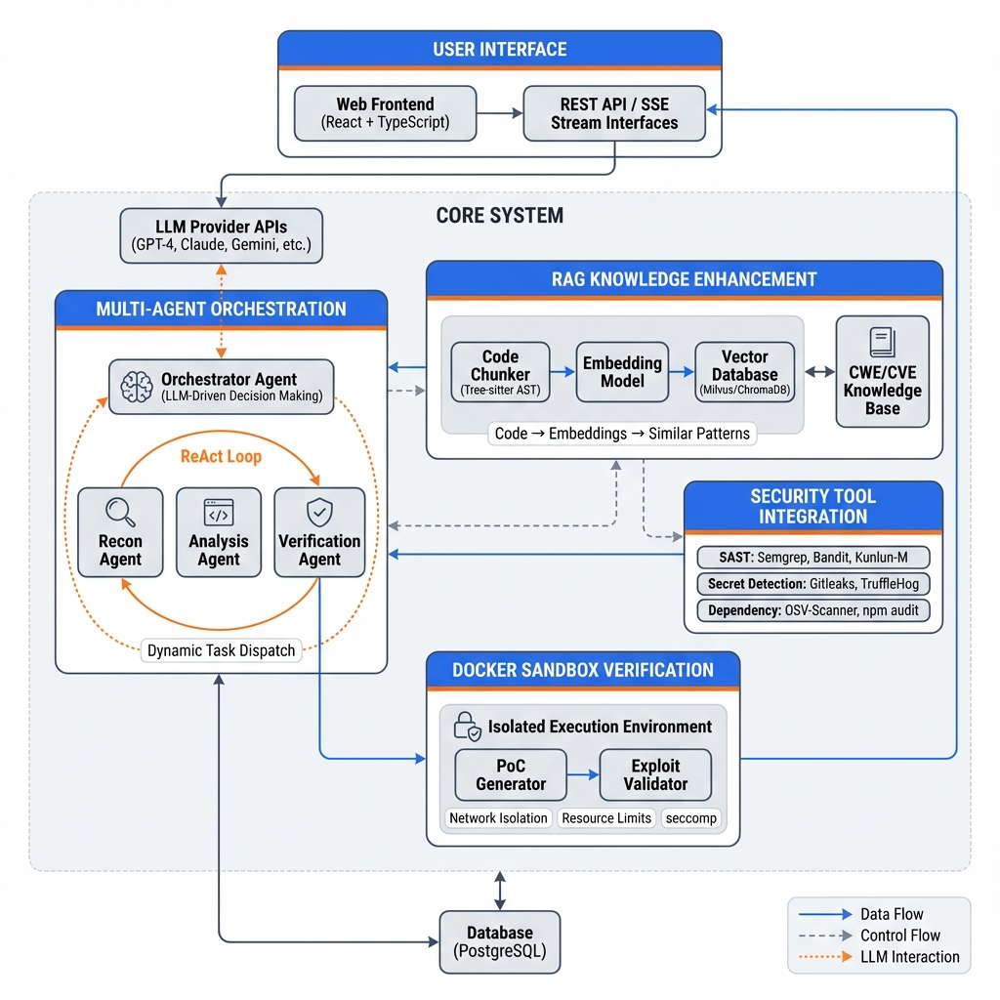

# DeepAudit: System Architecture for Academic Paper

This document provides the system architecture description suitable for top-tier academic conferences (ICSE, FSE, CCS, S&P, USENIX Security, etc.).

## Architecture Diagram



---

## System Overview

**DeepAudit** is an LLM-driven intelligent code security audit system that employs a **hierarchical multi-agent architecture** with **Retrieval-Augmented Generation (RAG)** and **sandbox-based vulnerability verification**.

### Key Contributions

1. **LLM-Driven Multi-Agent Orchestration**: A dynamic agent hierarchy where the LLM serves as the central decision-making brain, autonomously orchestrating specialized agents for reconnaissance, analysis, and verification.

2. **RAG-Enhanced Vulnerability Detection**: Integration of semantic code understanding with vulnerability knowledge bases (CWE/CVE) to reduce false positives and improve detection accuracy.

3. **Sandbox-Based Exploit Verification**: Docker-isolated execution environment for automated PoC generation and vulnerability confirmation.

---

## Architecture Components

### Layer 1: User Interface Layer

```
┌─────────────────────────────────────────────────────────────────┐
│                      User Interface Layer                        │
├─────────────────────────────────────────────────────────────────┤
│  ┌───────────────────┐    ┌───────────────────────────────────┐ │
│  │   Web Frontend    │    │        API Gateway                │ │
│  │  (React + TS)     │◄──►│  REST API / SSE Event Stream      │ │
│  └───────────────────┘    └───────────────────────────────────┘ │
└─────────────────────────────────────────────────────────────────┘
```

**Components:**
- **Web Frontend**: React 18 + TypeScript SPA with real-time log streaming
- **API Gateway**: FastAPI-based REST endpoints with SSE for real-time events

### Layer 2: Multi-Agent Orchestration Layer

```
┌─────────────────────────────────────────────────────────────────┐
│               Multi-Agent Orchestration Layer                    │
├─────────────────────────────────────────────────────────────────┤
│                                                                  │
│                    ┌─────────────────────┐                       │
│                    │  Orchestrator Agent │ ◄─── LLM Provider    │
│                    │  (ReAct Loop)       │      (GPT-4/Claude)  │
│                    └──────────┬──────────┘                       │
│                               │                                  │
│              ┌────────────────┼────────────────┐                 │
│              ▼                ▼                ▼                 │
│     ┌──────────────┐  ┌──────────────┐  ┌──────────────┐        │
│     │ Recon Agent  │  │Analysis Agent│  │Verification  │        │
│     │              │  │              │  │    Agent     │        │
│     │ • Structure  │  │ • SAST       │  │ • PoC Gen    │        │
│     │ • Tech Stack │  │ • Pattern    │  │ • Sandbox    │        │
│     │ • Entry Pts  │  │ • Dataflow   │  │ • Validation │        │
│     └──────────────┘  └──────────────┘  └──────────────┘        │
│                                                                  │
└─────────────────────────────────────────────────────────────────┘
```

**Key Design Decisions:**

| Component | Design Choice | Rationale |
|-----------|---------------|-----------|
| Orchestrator | LLM-driven ReAct loop | Dynamic strategy adaptation based on findings |
| Sub-Agents | Specialized roles | Domain expertise separation for precision |
| Communication | TaskHandoff protocol | Structured context passing between agents |
| Iteration Limits | Configurable (20/30/15) | Prevent infinite loops while ensuring depth |

### Layer 3: RAG Knowledge Enhancement Layer

```
┌─────────────────────────────────────────────────────────────────┐
│              RAG Knowledge Enhancement Layer                     │
├─────────────────────────────────────────────────────────────────┤
│                                                                  │
│  ┌─────────────┐    ┌─────────────┐    ┌─────────────────────┐  │
│  │ Code Chunker│    │  Embedding  │    │   Vector Database   │  │
│  │(Tree-sitter)│───►│   Model     │───►│     (ChromaDB)      │  │
│  └─────────────┘    └─────────────┘    └─────────────────────┘  │
│                                                    │             │
│  ┌─────────────────────────────────────────────────┼───────────┐│
│  │              CWE/CVE Knowledge Base             │           ││
│  │  • SQL Injection patterns                       ▼           ││
│  │  • XSS signatures                     ┌───────────────────┐ ││
│  │  • Command Injection                  │ Semantic Retriever│ ││
│  │  • Path Traversal                     └───────────────────┘ ││
│  │  • SSRF patterns                                            ││
│  │  • ...                                                      ││
│  └─────────────────────────────────────────────────────────────┘│
│                                                                  │
└─────────────────────────────────────────────────────────────────┘
```

**RAG Pipeline:**

1. **Code Chunking**: Tree-sitter based AST-aware chunking for semantic preservation
2. **Embedding**: Support for OpenAI text-embedding-3-small/large, local models
3. **Vector Store**: ChromaDB for lightweight deployment
4. **Retrieval**: Semantic similarity search with vulnerability pattern matching

### Layer 4: Security Tool Integration Layer

```
┌─────────────────────────────────────────────────────────────────┐
│              Security Tool Integration Layer                     │
├─────────────────────────────────────────────────────────────────┤
│                                                                  │
│  ┌─────────────────────────────────────────────────────────────┐│
│  │                    SAST Tools                                ││
│  │  ┌──────────┐  ┌──────────┐  ┌──────────┐  ┌──────────────┐ ││
│  │  │ Semgrep  │  │  Bandit  │  │Kunlun-M  │  │Pattern Match │ ││
│  │  │ (Multi)  │  │ (Python) │  │ (PHP/JS) │  │  (Fallback)  │ ││
│  │  └──────────┘  └──────────┘  └──────────┘  └──────────────┘ ││
│  └─────────────────────────────────────────────────────────────┘│
│                                                                  │
│  ┌────────────────────────┐  ┌────────────────────────────────┐ │
│  │   Secret Detection     │  │    Dependency Analysis         │ │
│  │  • Gitleaks            │  │  • OSV-Scanner                 │ │
│  │  • TruffleHog          │  │  • npm audit / pip-audit       │ │
│  └────────────────────────┘  └────────────────────────────────┘ │
│                                                                  │
└─────────────────────────────────────────────────────────────────┘
```

**Tool Selection Strategy:**

| Category | Primary Tool | Fallback | Coverage |
|----------|-------------|----------|----------|
| Multi-lang SAST | Semgrep | PatternMatch | 20+ languages |
| Python Security | Bandit | PatternMatch | Python-specific |
| PHP/JS Analysis | Kunlun-M | Semgrep | Semantic analysis |
| Secret Detection | Gitleaks | TruffleHog | Git history scan |
| Dependencies | OSV-Scanner | npm/pip audit | Multi-ecosystem |

### Layer 5: Sandbox Verification Layer

```
┌─────────────────────────────────────────────────────────────────┐
│                Sandbox Verification Layer                        │
├─────────────────────────────────────────────────────────────────┤
│                                                                  │
│  ┌─────────────────────────────────────────────────────────────┐│
│  │                 Docker Sandbox Container                     ││
│  │  ┌────────────────────────────────────────────────────────┐ ││
│  │  │              Security Constraints                       │ ││
│  │  │  • Network: Isolated / No external access              │ ││
│  │  │  • Resources: Memory 512MB / CPU 1.0                   │ ││
│  │  │  • Syscalls: seccomp whitelist policy                  │ ││
│  │  │  • Timeout: 60 seconds max execution                   │ ││
│  │  └────────────────────────────────────────────────────────┘ ││
│  │                                                              ││
│  │  ┌──────────────────┐    ┌──────────────────────────────┐   ││
│  │  │   PoC Generator  │───►│     Exploit Validator        │   ││
│  │  │  (LLM-assisted)  │    │  (Execution + Verification)  │   ││
│  │  └──────────────────┘    └──────────────────────────────┘   ││
│  │                                                              ││
│  └─────────────────────────────────────────────────────────────┘│
│                                                                  │
└─────────────────────────────────────────────────────────────────┘
```

**Verification Workflow:**

1. **PoC Generation**: LLM generates exploitation code based on vulnerability analysis
2. **Sandbox Setup**: Docker container with strict security constraints
3. **Execution**: Run PoC in isolated environment
4. **Validation**: Check execution results against expected vulnerability behavior
5. **Confidence Scoring**: Assign verification confidence (0-1)

---

## Data Flow Diagram

```
┌─────────────────────────────────────────────────────────────────────────────┐
│                           DeepAudit Data Flow                                │
└─────────────────────────────────────────────────────────────────────────────┘

   ┌──────────┐                                              ┌──────────────┐
   │   User   │                                              │   Reports    │
   │ Request  │                                              │  (MD/JSON)   │
   └────┬─────┘                                              └──────▲───────┘
        │                                                           │
        ▼                                                           │
┌───────────────┐    ┌─────────────────────────────────────────────┴───────┐
│  API Gateway  │───►│                   PostgreSQL DB                      │
└───────┬───────┘    │  • Tasks  • Findings  • Projects  • Reports         │
        │            └─────────────────────────────────────────────────────┘
        ▼
┌───────────────────────────────────────────────────────────────────────────┐
│                         Orchestrator Agent                                 │
│                                                                            │
│   ┌─────────────┐      ┌─────────────────────────────────────────────┐    │
│   │ LLM Service │◄────►│              ReAct Decision Loop             │    │
│   │ (GPT/Claude)│      │  Thought → Action → Observation → Thought   │    │
│   └─────────────┘      └───────────────────┬─────────────────────────┘    │
│                                            │                               │
│              ┌─────────────┬───────────────┼───────────────┐              │
│              ▼             ▼               ▼               ▼              │
│      ┌─────────────┐ ┌───────────┐ ┌────────────┐ ┌──────────────┐       │
│      │    Recon    │ │  Analysis │ │Verification│ │   Finish     │       │
│      │    Agent    │ │   Agent   │ │   Agent    │ │   Action     │       │
│      └──────┬──────┘ └─────┬─────┘ └──────┬─────┘ └──────────────┘       │
│             │              │              │                               │
└─────────────┼──────────────┼──────────────┼───────────────────────────────┘
              │              │              │
              ▼              ▼              ▼
       ┌────────────┐ ┌────────────┐ ┌────────────┐
       │ File Tools │ │ SAST Tools │ │  Sandbox   │
       │ list/read  │ │ Semgrep... │ │   Docker   │
       └─────┬──────┘ └─────┬──────┘ └──────┬─────┘
             │              │               │
             │       ┌──────┴──────┐        │
             │       ▼             │        │
             │  ┌─────────┐        │        │
             └─►│   RAG   │◄───────┘        │
                │ Pipeline│                 │
                └────┬────┘                 │
                     │                      │
                     ▼                      ▼
              ┌────────────┐        ┌────────────┐
              │  Vector DB │        │ Verification│
              │  ChromaDB  │        │   Result    │
              └────────────┘        └────────────┘
```

---

## Algorithm: Multi-Agent Audit Orchestration

```
Algorithm 1: LLM-Driven Multi-Agent Security Audit

Input: Project P, Target vulnerabilities V, Configuration C
Output: Findings F, Verification Results R

1:  Initialize Orchestrator Agent with LLM
2:  Create sub-agents: Recon, Analysis, Verification
3:  findings ← ∅
4:  verified_results ← ∅
5:  
6:  // Phase 1: Reconnaissance
7:  recon_result ← ReconAgent.run(P, V)
8:  high_risk_areas ← recon_result.priority_areas
9:  
10: // Phase 2: Orchestration Loop
11: while iteration < MAX_ITERATIONS do
12:     thought, action ← LLM.reason(context, history)
13:     
14:     if action = "dispatch_agent" then
15:         agent ← select_agent(action.params)
16:         result ← agent.run(action.task, context)
17:         findings ← findings ∪ result.findings
18:         update_context(result)
19:     else if action = "finish" then
20:         break
21:     end if
22:     
23:     iteration ← iteration + 1
24: end while
25: 
26: // Phase 3: Verification
27: for each f ∈ findings where f.severity ≥ HIGH do
28:     poc ← LLM.generate_poc(f)
29:     result ← Sandbox.execute(poc)
30:     verified_results ← verified_results ∪ {(f, result)}
31: end for
32: 
33: return (findings, verified_results)
```

---

## Evaluation Metrics

For academic evaluation, we suggest the following metrics:

### Detection Effectiveness

| Metric | Formula | Description |
|--------|---------|-------------|
| Precision | TP / (TP + FP) | Accuracy of reported vulnerabilities |
| Recall | TP / (TP + FN) | Coverage of actual vulnerabilities |
| F1-Score | 2 × (P × R) / (P + R) | Harmonic mean of precision and recall |

### Efficiency Metrics

| Metric | Description |
|--------|-------------|
| Time-to-Detection (TTD) | Time from start to first vulnerability found |
| Total Audit Time | End-to-end execution time |
| LLM Token Usage | Total tokens consumed during audit |
| Tool Invocation Count | Number of external tool calls |

### Verification Quality

| Metric | Description |
|--------|-------------|
| Verification Rate | Percentage of findings verified via sandbox |
| False Positive Reduction | % reduction after verification |
| PoC Success Rate | Successful exploit demonstrations |

---

## Comparison with Related Work

| System | Multi-Agent | RAG | Sandbox | LLM-Driven |
|--------|-------------|-----|---------|------------|
| CodeQL | ✗ | ✗ | ✗ | ✗ |
| Semgrep | ✗ | ✗ | ✗ | ✗ |
| Snyk Code | ✗ | ✗ | ✗ | Partial |
| GitHub Copilot | ✗ | ✗ | ✗ | ✓ |
| **DeepAudit** | **✓** | **✓** | **✓** | **✓** |

---

## LaTeX TikZ Diagram Code

For LaTeX papers, you can use the following TikZ code:

```latex
\begin{figure}[t]
\centering
\begin{tikzpicture}[
    node distance=1cm,
    box/.style={rectangle, draw, rounded corners, minimum width=2.5cm, minimum height=0.8cm, align=center},
    agent/.style={box, fill=blue!10},
    tool/.style={box, fill=orange!10},
    rag/.style={box, fill=green!10},
    sandbox/.style={box, fill=red!10},
    arrow/.style={->, >=stealth, thick}
]

% Orchestrator
\node[agent] (orch) {Orchestrator Agent};

% Sub-agents
\node[agent, below left=1.5cm and 1cm of orch] (recon) {Recon Agent};
\node[agent, below=1.5cm of orch] (analysis) {Analysis Agent};
\node[agent, below right=1.5cm and 1cm of orch] (verify) {Verification Agent};

% Connections
\draw[arrow] (orch) -- (recon);
\draw[arrow] (orch) -- (analysis);
\draw[arrow] (orch) -- (verify);

% Tools
\node[tool, below=1cm of analysis] (tools) {SAST Tools\\Semgrep, Bandit, Kunlun-M};

% RAG
\node[rag, left=1cm of tools] (rag) {RAG Pipeline\\Vector DB + CWE/CVE};

% Sandbox
\node[sandbox, right=1cm of tools] (sandbox) {Docker Sandbox\\PoC Verification};

% Tool connections
\draw[arrow] (analysis) -- (tools);
\draw[arrow, dashed] (tools) -- (rag);
\draw[arrow] (verify) -- (sandbox);

% LLM
\node[box, fill=purple!10, above=0.5cm of orch] (llm) {LLM Provider\\GPT-4 / Claude};
\draw[arrow, <->] (orch) -- (llm);

\end{tikzpicture}
\caption{DeepAudit System Architecture}
\label{fig:architecture}
\end{figure}
```

---

## Citation

If you use DeepAudit in your research, please cite:

```bibtex
@software{deepaudit2024,
  title = {DeepAudit: LLM-Driven Multi-Agent Code Security Audit System with RAG Enhancement and Sandbox Verification},
  author = {Lin Tsinghua},
  year = {2024},
  url = {https://github.com/lintsinghua/DeepAudit},
  version = {3.0.0}
}
```
